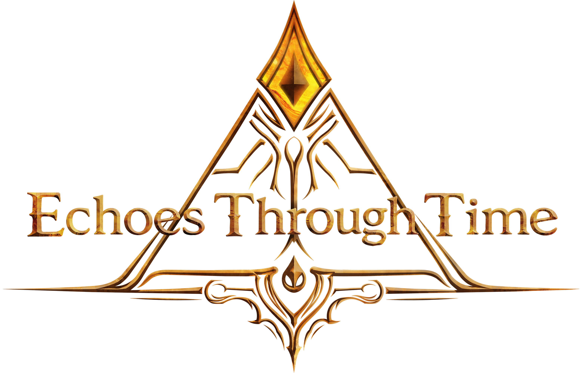
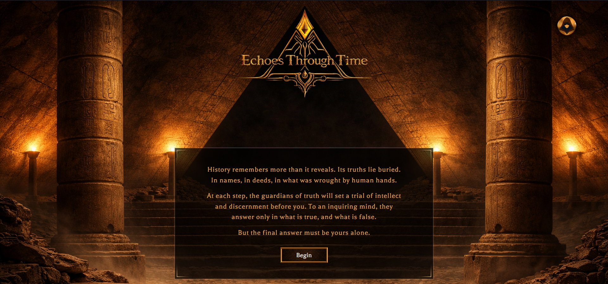
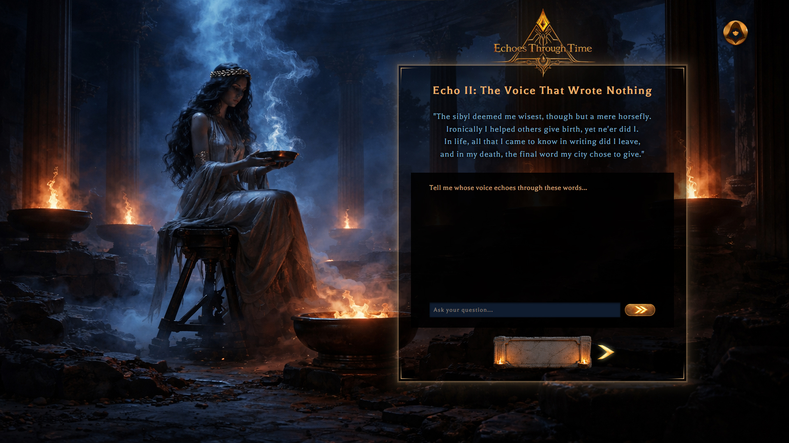
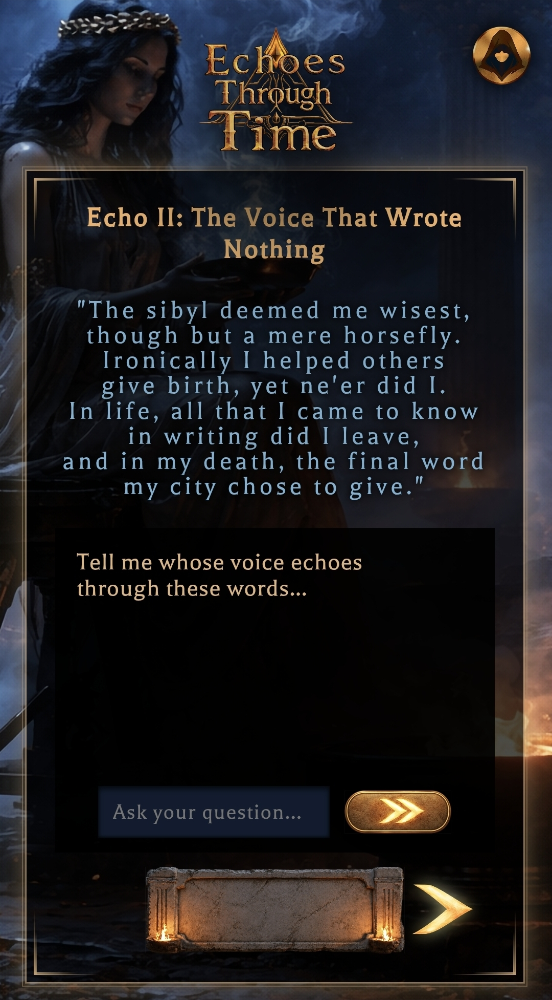
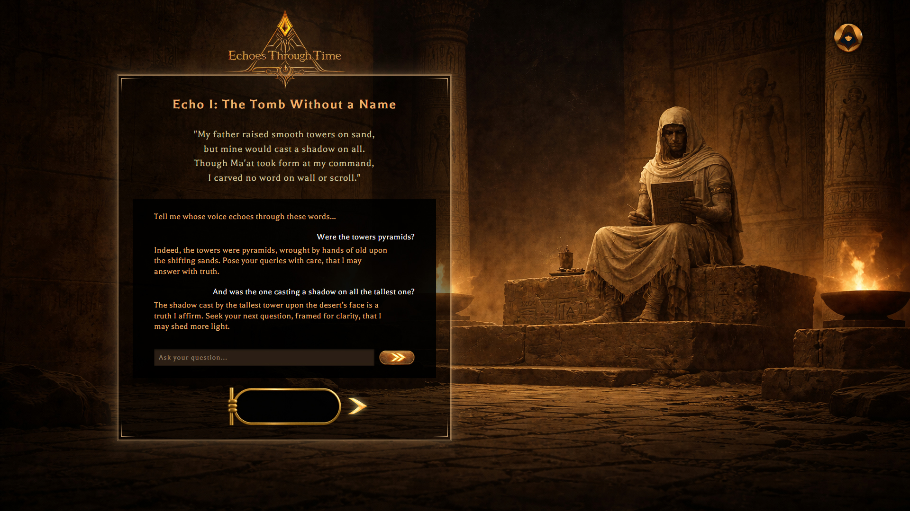
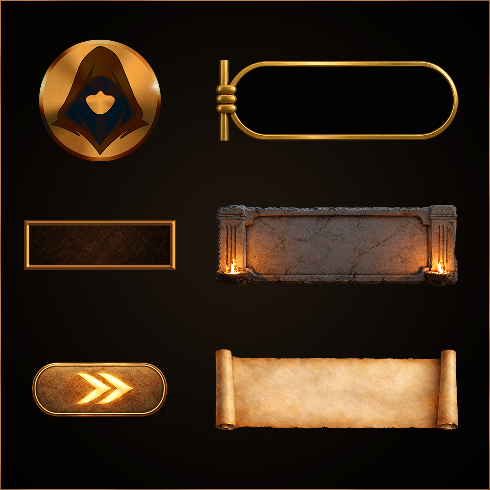
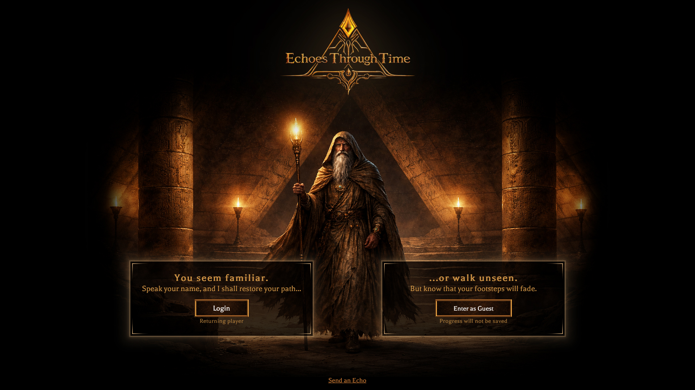
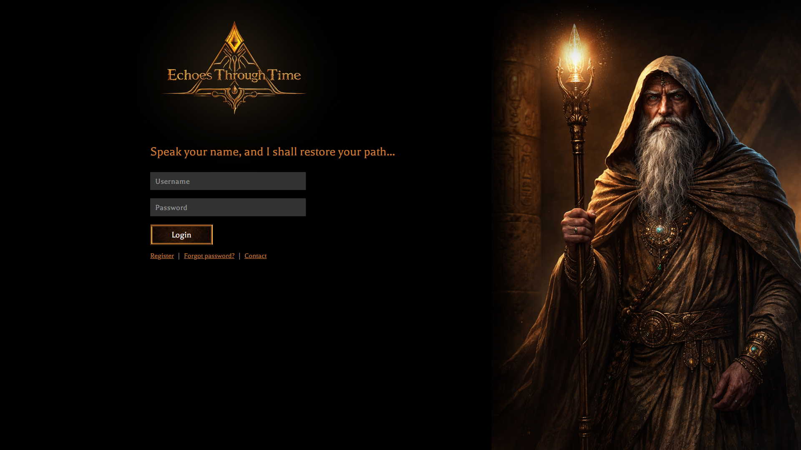
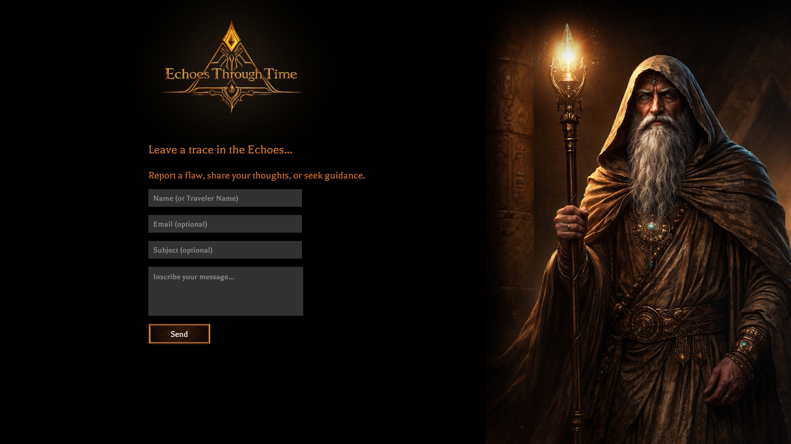
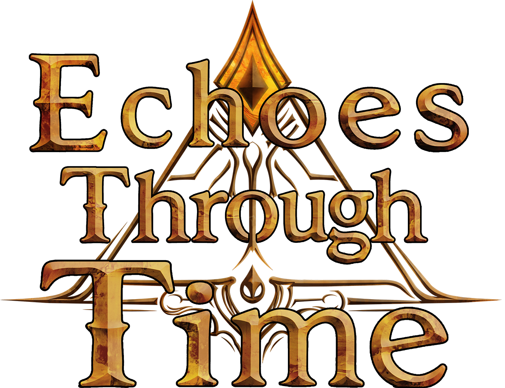

  

# Echoes Through Time

> Echoes Through Time is a narrative-driven riddle adventure web application featuring persistent user progression, AI-powered NPC interactions, responsive multi-device design, and custom-crafted visual identity.

 

  

  <a href="https://echoestime.com"><strong>Explore the Project Online</strong></a>

---

# Project Overview

Echoes Through Time is a narrative-focused riddle-solving web application inspired by historical settings and atmospheric mystery. Players progress through a series of themed challenges by interpreting riddles, consulting AI-powered NPCs, and uncovering answers through dialogue and deduction.

Built with PHP, JavaScript, MySQL, and OpenAI APIs, the project combines persistent progression systems, contextual NPC interactions, and responsive multi-device design within a modular level architecture built for scalability.

The application was developed around a reusable “engine + content” philosophy, where each level inherits shared gameplay systems while introducing its own narrative theme, visual identity, NPC behavior, and riddle structure.

Custom-designed interface elements were created to integrate seamlessly with AI-assisted environmental artwork, with a strong emphasis on thematic cohesion, immersion, and responsive design across desktop and mobile layouts.

---

  
  &nbsp;
  

---

# Core Features

## AI-Powered NPC Interactions
Each level features a dedicated NPC powered by the OpenAI API, designed to guide the player through dialogue and deduction rather than direct exposition. Inspired by classic yes/no deduction games such as *Guess Who?*, the interaction system encourages players to test theories, refine questions, and uncover answers through logical inquiry.

 

  

## Persistent Progression System
Player progression is tracked through a MySQL-backed save system supporting both authenticated users and temporary guest sessions. Returning players automatically resume from their latest unlocked level, while conversation history and gameplay state persist across sessions.

## Modular Level Architecture
The project was built around a reusable “engine + content” structure, where each level inherits shared gameplay systems while supplying its own configuration, NPC behavior, visual theme, and riddle content. This approach allows new levels to be added with minimal changes to the core application logic.

## Responsive Multi-Device Design
The interface was designed and tested with responsiveness as a central priority, with dedicated adaptations for desktop, tablet, and mobile portrait/landscape layouts. Particular attention was given to maintaining readability, usability, and visual cohesion across varying aspect ratios and device types.

## Context-Aware Conversation Memory
To improve conversational continuity, NPCs receive recent conversation history as contextual memory alongside each new question. This allows players to ask follow-up or clarifying questions naturally without needing to fully repeat previous context.

  

## Custom Visual Identity
All interface elements, including buttons, decorative frames, icons, sigils, and themed input components, were custom designed to integrate seamlessly with AI-assisted environmental artwork. The project places strong emphasis on atmospheric consistency and cohesive visual presentation.

## Historical Atmosphere and Inspiration
Several historical settings and thematic ideas were loosely inspired by the atmosphere and historical framing of the *Assassin’s Creed* franchise, while the gameplay structure and implementation were designed specifically for this project.

---

  

# Technical Overview

Echoes Through Time was developed as a full-stack web application using PHP, JavaScript, MySQL, HTML, and CSS, with OpenAI API integration powering the NPC interaction system.

The backend architecture focuses on reusable systems and persistent state management. Gameplay progression, authentication, guest sessions, and NPC conversation history are handled through reusable PHP systems and MySQL-backed data storage. Shared gameplay logic, such as level guarding, progression tracking, NPC loading, and solved-state handling, was centralized into reusable components to support scalability and maintainability.

The frontend was built using vanilla JavaScript and custom CSS without external frameworks. Asynchronous communication between the player and NPCs is handled through fetch-based requests, allowing conversations to occur dynamically without page reloads. Reusable frontend systems were developed for overlays, dropdowns, popups, responsive layouts, and animated interaction feedback.

The NPC interaction layer combines dedicated system prompts, modular level configuration files, and contextual conversation memory to create distinct behaviors and conversational roles for each historical “guardian” encountered throughout the experience.

The publicly available repository represents a curated, portfolio-safe version of the project and intentionally includes only the first playable level, while preserving the full architectural structure of the application.

---

# Design and Architecture Philosophy

The project was developed around a reusable “engine + content” philosophy, where shared gameplay systems, including progression validation, AI interaction handling, persistent chat systems, solved-state logic, and responsive layouts, could support entirely new levels through modular configuration, styling, and NPC behavior rather than structural rewrites.

A strong emphasis was placed on maintaining immersion through both visual consistency and spatial separation of functionality. User-oriented systems such as authentication, password recovery, and contact pages were intentionally designed as distinct interface spaces from the gameplay areas, while still preserving a unified thematic identity across the application.

 

  
  

Custom interface elements, including buttons, icons, decorative frames, sigils, and themed input components, were designed specifically for the project in order to integrate seamlessly with AI-assisted environmental artwork and reinforce the atmosphere of each historical setting.

While several historical themes were loosely inspired by the atmospheric presentation of the *Assassin’s Creed* franchise, the gameplay systems and web architecture were developed specifically for this project.

---

# What I Learned

Echoes Through Time became my first large-scale full-stack web project and gradually evolved far beyond its original scope. What began as a smaller academic project eventually grew into a modular application combining backend systems, responsive frontend design, asynchronous communication, database persistence, and AI-assisted gameplay mechanics.

Throughout development, I gained practical experience working with session handling, authentication flows, MySQL integration, API communication, and dynamic frontend behavior using vanilla JavaScript. The project also pushed me to think more carefully about architectural decisions, particularly around modularity, scalability, and separating reusable systems from level-specific content.

One of the most valuable lessons from the project was balancing immersion-focused design with usability and maintainability. Considerable effort was placed into responsive layouts, UI consistency, and preserving thematic cohesion across both gameplay and utility-oriented sections of the application.

The project also marked my first significant experience deploying and maintaining a live web application, and preparing a production-oriented version of the codebase suitable for portfolio presentation and long-term expansion.

---

  

# Repository Notes

This repository contains a curated, portfolio-oriented version of the project intended for technical presentation and code review.

Only the first playable level and its supporting systems are included publicly, while additional levels, assets, configuration details, and production-sensitive implementation components have been intentionally omitted.

All publicly exposed files were sanitized prior to publication to remove credentials, private configuration values, and deployment-sensitive information.
